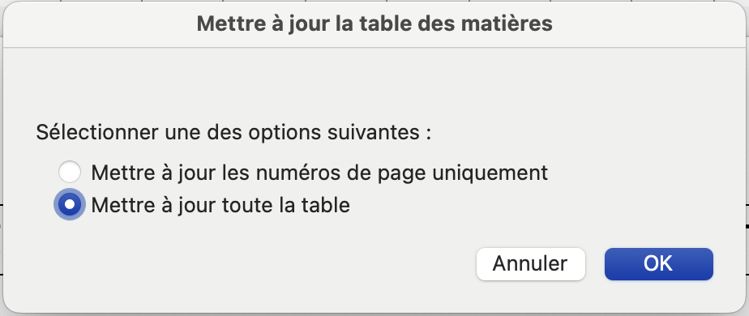

# Mise en forme d’un document à l’aide des styles

## Introduction

Vous allez travailler avec le document [Histoire_ordinateur_brut.docx](fichiers_styles/Histoire_ordinateur_brut.docx).

Le but de ce document est de vous guider dans la mise en forme et de vous montrer les fonctionnalités de base des styles qui permettent de présenter efficacement un document long.

## La forme

Le document “Histoire_ordinateur_brut.docx” est composé de titres de différents niveaux :

```{figure} fichiers_styles/img_25.png
:width: 700px
Figure {nump}`figure`: table des matières
```

Mais tout d’abord, qu’entend-on par “niveau” ? C’est tout simple, notre document contient une hiérarchie, c’est-à-dire qu’il contient des éléments qui vont du plus important au moins important :

  - Un titre principal
  - Des sections
  - Des sous-sections

Les sections correspondent à la numérotation 1, 2, 3, 4, etc. et les sous-sections à la numérotation 1.1, 1.2, 2.1, etc.

Afin de pouvoir numéroter ces titres facilement et de créer une table des matières automatique, voici notre plan de travail qui sera exécuté dans cet ordre :

  - Associer à chacun des niveaux de titres un style
  - Lier la numérotation aux différents styles de titres
  - Créer une table des matières automatique

## Appliquer un style

### Activer le styliste

Pour afficher la fenêtre du styliste, il faut cliquer sur :

````{list-grid}
:style: grid-template-columns: 1fr 1fr;
- ```{figure} fichiers_styles/img_19.png
   :width: 100px
   Figure {nump}`figure`: sur Mac OS
   ```
- ```{figure} fichiers_styles/img_16.png
   :width: 100px
   Figure {nump}`figure`: sur Windows
   ```
````

Apparaît alors la fenêtre suivante :

```{figure} fichiers_styles/img_08.png
Figure {nump}`figure`: fenêtre de styles
```


### Organisation du document

Le document est organisé de la manière suivante :

| **Élément du document** | **Nom du style** | **Numérotation** |
| --- | --- | --- |
| Histoire de l’ordinateur | Titre | Aucune |
| Titres de sections | Titre 1 | 1. |
| Titres de sous-sections | Titre 2 | 1.1. |

Tous les titres sont des éléments de type paragraphe.

### Appliquer un style

Pour appliquer un style, c’est-à-dire lier un élément avec un style, 2 étapes sont nécessaires :

  - Cliquer une fois sur le paragraphe auquel on souhaite appliquer le style
  - Cliquer sur le style à appliquer

Par exemple, si on clique sur le titre du document « Histoire de l’ordinateur » et que l’on clique ensuite sur Titre, on obtient le résultat :

```{figure} fichiers_styles/img_26.png
:width: 700px
Figure {nump}`figure`: exemple d'utilisation du style Titre
```

Et pour les titres de sections et sous-sections on obtient le résultat :

```{figure} fichiers_styles/img_01.png
:width: 700px
Figure {nump}`figure`: exemple d'utilisation des styles Titre 1 & 2
```

> **Maintenant à vous de jouer**  
> Appliquez tous les styles en respectant la forme qui est donnée.  
> Appliquez les styles dans l’ordre de leur importance (pour vous aider, les titres ont été colorés) :  
> Titre (en vert dans le texte)  
> Titre 1 (en rouge dans le texte)  
> Titre 2 (en bleu dans le texte)


| **Élément du document** | **Nom du style** |
| --- | --- |
| Histoire de l’ordinateur | Titre principal |
| Titres de sections | Titre 1 |
| Titres de sous-sections | Titre 2 |

Les sections correspondent à la numérotation 1, 2, 3, 4, etc. et les sous-sections à la numérotation 1.1, 1.2, 2.1, etc.

## Ajouter la numérotation

Maintenant que chaque type de titre a son style défini, on peut ajouter une numérotation automatique des sections et sous-sections.

Depuis le menu Accueil, section Paragraphe, cliquer sur Liste à plusieurs niveaux :

```{figure} fichiers_styles/img_20.png
:width: 150px
Figure {nump}`figure`: menu de choix de la numérotation
```

Ensuite cliquer sur le style de liste à plusieurs niveaux :

```{figure} fichiers_styles/img_12.png
:width: 700px
Figure {nump}`figure`: numérotation des titres
```

> **Maintenant à vous de jouer**  
> Appliquez la numérotation aux sections et sous-sections.  
> Observez le résultat : chaque titre a été automatiquement numéroté.  
> Si on ajoute ou on efface un titre ou le déplace, la numérotation est automatiquement adaptée.

## Insérer une table des matières

Maintenant que nos titres sont bien définis et que la numérotation est en place, l’ajout de la table des matières est simple.

Référence puis Table des matières et choisir Classique :

```{figure} fichiers_styles/img_06.png
:width: 400px
Figure {nump}`figure`: insertion de la table des matières
```

> **Maintenant à vous de jouer**  
> Insérez une table des matières après le titre principal (placez le curseur directement après (derrière, pas dessous) le titre principal).  
> Quand vous aurez terminé votre document, il faudra faire un clic droit sur la table des matières pour la mettre à jour :  
> {width=200}   
> puis  
> {width=400}

## En-tête, pied de page et numérotation des pages

### Entête et pied de page

Les en-têtes et pieds de page sont des zones qui s'insèrent respectivement en haut et en bas de toutes les pages d'un document et qui sont destinées à des informations qui ne font pas partie du texte principal mais qui doivent figurer sur toutes les pages (logo d'entreprise, numérotation des pages, titre et auteur du document, nom du fichier avec son chemin sur le disque, etc.).

Ces informations sont souvent introduites sous forme de champs pour permettre leur actualisation dans le temps par suite de modifications entreprises sur le document.

Pour ajouter une en-tête ou un pied de page vous pouvez agir de deux façons :

Double cliquer sur la partie supérieure ou inférieure d’un page quelconque

Utiliser le menu Insérer -> En-tête / pied de page :

```{figure} fichiers_styles/img_17.png
:width: 200px
Figure {nump}`figure`: différentes options pour en-têtes et pieds de page
```

```{figure} fichiers_styles/img_30.png
:width: 300px
Figure {nump}`figure`: différentes options pour en-têtes et pieds de page
```

```{figure} fichiers_styles/img_04.png
:width: 300px
Figure {nump}`figure`: différentes options pour en-têtes et pieds de page
```

```{figure} fichiers_styles/img_21.png
:width: 400px
Figure {nump}`figure`: apparence du pied de page
```

### Numérotation des pages

Word vous permet d’insérer des données gérées par le système telles que la date, l’heure ou le numéro de page* :*

```{figure} fichiers_styles/img_13.png
Figure {nump}`figure`: champs date et heure
```

```{figure} fichiers_styles/img_09.png
Figure {nump}`figure`: champ numéro de page
```

> **Maintenant à vous de jouer**  
> Après avoir activé le pied de page, insérer le numéro de page à droite.  
> Il suffit d’insérer le numéro de page sur une des pages et les autres pages seront automatiquement numérotées correctement.

## Bibliographie

Vous allez devoir ajouter une bibliographie. Pour cela, rendez-vous dans le menu Références.

### Insérer une section bibliographie

Choisissez le format de la bibliographie (ISO 690 – Premier élément et date pour un document en français, APA pour un document en allemand) :

```{figure} fichiers_styles/img_28.png
:width: 300px
Figure {nump}`figure`: bibliographie ISO 690
```

```{figure} fichiers_styles/img_03.png
:width: 300px
Figure {nump}`figure`: bibliographie APA
```

Allez tout à la fin du document et cliquez sur :

```{figure} fichiers_styles/img_22.png
:width: 300px
Figure {nump}`figure`: insertion d'une bibliographie
```

puis choisissez la 1ère possibilité :

```{figure} fichiers_styles/img_14.png
:width: 700px
Figure {nump}`figure`: choix du style de bibliographie
```

Une nouvelle section va apparaitre à la fin de votre document :

```{figure} fichiers_styles/img_07.png
:width: 500px
Figure {nump}`figure`: nouvelle section
```

### Ajouter les sources

Toujours dans Références, cliquer sur Citations :

```{figure} fichiers_styles/img_23.png
Figure {nump}`figure`
```

Une fenêtre s’ouvre à droite :

```{figure} fichiers_styles/img_18.png
:width: 400px
Figure {nump}`figure`
```

Cliquez sur le + pour ajouter vos sources (il faut choisir à chaque fois le type de source) :

```{figure} fichiers_styles/img_10.png
:width: 400px
Figure {nump}`figure`
```

Pour le document sur l’histoire de l’ordinateur, il y a une unique source que vous remplirez de cette manière :

```{figure} fichiers_styles/img_29.png
:width: 700px
Figure {nump}`figure`
```
Vous aurez alors dans la fenêtre des citations :

```{figure} fichiers_styles/img_05.png
:width: 300px
Figure {nump}`figure`
```

### Citer les sources

Allez ensuite à la fin du titre principal du document puis allez dans Insérer puis :

```{figure} fichiers_styles/img_24.png
:width: 100px
Figure {nump}`figure`
```

puis double-cliquez sur le document que vous voulez citer :

```{figure} fichiers_styles/img_05.png
:width: 300px
Figure {nump}`figure`
```

### Mettre à jour la bibliographie

Allez ensuite à la fin de votre document où se trouve la section Bibliographie et faites un clic droit puis choisissez « Mettre à jour le champ » :

```{figure} fichiers_styles/img_15.png
:width: 700px
Figure {nump}`figure`
```

La bibliographie va se mettre automatiquement à jour :

```{figure} fichiers_styles/img_11.png
:width: 500px
Figure {nump}`figure`
```

Vous pouvez télécharger le résultat final : [Histoire_ordinateur_final.pdf](fichiers_styles/Histoire_ordinateur_final.pdf)
