# Ensembles, Nombres et Équations

**Mathématiques 1ère année**

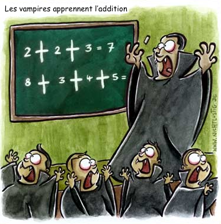

*David Rueda — 2020/21*

---

## Table des matières

1. [Ensembles](#1-ensembles)
2. [Nombres](#2-nombres)
3. [Équations](#3-équations)
4. [Inéquations](#4-inéquations)
5. [Répétitions](#5-répétitions)

---

# 1. Ensembles

## 1.1 Découvrir

Imagine ta classe comme un ensemble et appelons cet ensemble $C$. Chaque élève de ta classe est par conséquent un élément de cet ensemble $C$. L'ensemble $C$ peut être illustré grâce à un diagramme en insérant chaque élément (prénoms des élèves) dans une bulle :

.png)

L'ensemble $C$ possède différents sous-ensembles comme par exemple :

- L'ensemble $G$ des garçons.
- L'ensemble $F$ des filles.
- L'ensemble $X$ des élèves ayant leur anniversaire dans les quatre premiers mois de l'année (janvier, février, mars ou avril).
- L'ensemble $Y$ des élèves ayant leur anniversaire dans les quatre mois du milieu de l'année (mai, juin, juillet ou août).
- L'ensemble $Z$ des élèves ayant leur anniversaire dans les quatre derniers mois de l'année (septembre, octobre, novembre ou décembre).
- L'ensemble $M$ des élèves qui aiment venir au cours de mathématiques.
- L'ensemble $A$ des élèves ayant un animal domestique à la maison.
- L'ensemble $I$ des élèves qui jouent d'un instrument.
- L'ensemble $L$ des élèves qui portent des lunettes ou des lentilles.

Écris pour les sous-ensembles ci-dessus les prénoms des élèves concernés dans les bulles correspondantes.

.png)

.png)

Explique comment tu détermines les élèves qui se trouvent dans les ensembles suivants en utilisant les bulles de la page précédente.

a) L'ensemble des élèves ayant leur anniversaire dans les premiers huit mois de l'année.

b) L'ensemble des élèves n'ayant pas une mauvaise vue.

c) L'ensemble des filles qui aiment venir au cours de mathématiques.

d) L'ensemble des garçons qui jouent d'un instrument.

e) L'ensemble des élèves qui portent des lunettes ou des lentilles et qui n'ont pas d'animal domestique.

f) L'ensemble des élèves ayant un animal domestique et n'ayant pas leur anniversaire dans les derniers quatre mois de l'année.

g) L'ensemble des élèves ayant leur anniversaire dans les premiers ou les derniers quatre mois de l'année.

h) L'ensemble des élèves ayant leur anniversaire dans les premiers et les derniers quatre mois de l'année.

---

## 1.2 Théorie

La logique ainsi que la théorie des ensembles sont des outils importants pour les mathématiques, car beaucoup de constructions et problèmes mathématiques se laissent illustrer et/ou résoudre à l'aide des ensembles :

- Une droite est un ensemble de points qui remplissent une certaine condition (une équation).
- Un cercle est un ensemble de points équidistants (le rayon) d'un point donné (le centre du cercle).

De plus la théorie des ensembles nous permet de mieux comprendre la théorie des probabilités (traitée plus tard au collège).

> **Définition**
>
> Un **ensemble** $E$ est une collection d'objets. Ces objets sont appelés **éléments** de l'ensemble $E$ et ne peuvent figurer qu'une seule fois dans l'ensemble.
>
> Si $x$ est un objet de $E$, nous notons $x \in E$ (cela veut dire « $x$ appartient à $E$ » ou « $x$ est un élément de $E$ »).
> Si par contre $x$ n'est pas un élément de $E$, nous notons $x \notin E$.

Il existe plusieurs façons de décrire un ensemble :

- Un ensemble peut être **défini en extension**. Dans ce cas on énumère simplement les éléments d'un ensemble dans des accolades. Si l'ensemble est infini on peut utiliser trois petits points au début ou à la fin de l'énumération.

  **Exemple :** $\{$Chris, Jonny, Will, Guy$\}$ ou $\{1,3,5,7,9,\ldots\}$

- Un ensemble peut être **défini en compréhension**, c'est-à-dire qu'on le définit par une propriété caractéristique parmi les éléments d'un ensemble de base donné. Cette propriété est notée dans les accolades après un trait de séparation.

  **Exemple :** $\{x \in \text{Ensemble des animaux} \mid x \text{ a quatre pattes}\}$ ou $\{x \in \mathbb{Z} \mid -4 \leq x \leq 4\}$ (l'ensemble des nombres entiers entre $-4$ et $4$)

- Les ensembles peuvent aussi être illustrés par des bulles (voir exercice d'introduction).

> **Définitions**
>
> 1. L'**ensemble vide** est l'ensemble ne contenant aucun élément. Il est noté $\{\,\}$ ou $\varnothing$.
> 2. Un ensemble $A$ est **sous-ensemble** d'un ensemble $B$ si tout élément de $A$ est également élément de $B$. Nous notons $A \subset B$.
> 3. L'ensemble des sous-ensembles d'un ensemble $A$ est appelé l'**ensemble des parties d'un ensemble**. On note cet ensemble $\mathcal{P}(A)$ ou $P(A)$.

> **Remarques**
>
> 1. L'ordre dans lequel les éléments d'un ensemble sont énumérés ne joue aucun rôle.
> 2. Un élément ne peut figurer qu'une seule fois dans un ensemble.
> 3. L'ensemble vide est un sous-ensemble de tout ensemble.
> 4. Un ensemble est toujours sous-ensemble de lui-même.
> 5. Les accolades sont réservées pour décrire des ensembles.

Les opérations sur les ensembles définissent des nouveaux ensembles à partir d'ensembles donnés. Nous apprendrons quatre opérations fondamentales sur les ensembles.

---

> **Définition**
>
> Soient $A$ et $B$ deux sous-ensembles d'un ensemble plus grand $M$.
>
> 1. L'**intersection** $A \cap B$ des ensembles $A$ et $B$ est l'ensemble de tous les éléments appartenant simultanément à $A$ et $B$. On écrit
>    $$A \cap B = \{x \in M \mid x \in A \textbf{ et } x \in B\}$$
>
> 2. La **réunion** $A \cup B$ des ensembles $A$ et $B$ est l'ensemble des éléments appartenant à $A$ ou à $B$ (ou aux deux). On écrit
>    $$A \cup B = \{x \in M \mid x \in A \textbf{ ou } x \in B\}$$
>
> 3. La **différence** $A \setminus B$ est l'ensemble de tous les éléments de $A$ n'appartenant pas à $B$. On écrit
>    $$A \setminus B = \{x \in M \mid x \in A \text{ et } x \notin B\}$$
>
> 4. Le **complémentaire** $\overline{A}$ par rapport à $M$ est l'ensemble des éléments qui n'appartiennent pas à $A$. On écrit
>    $$\overline{A} = M \setminus A = \{x \in M \mid x \notin A\}$$

On peut visualiser ces quatre opérations par des diagrammes pour mieux les comprendre. Les diagrammes d'ensembles sont appelés des **diagrammes de Venn**.

| | |
|:---:|:---:|
|  |  |
| *L'intersection* | *La réunion* |
|  |  |
| *La différence* | *Le complémentaire* |

---

> **Remarques**
>
> 1. On peut avoir un enchaînement de ces opérations. Pour éviter des malentendus il est conseillé d'utiliser des parenthèses. On peut facilement voir que $A \cup (B \cap C)$ et $(A \cup B) \cap C$ ne représentent pas le même ensemble.
>
> 2. Pour éviter la confusion avec la virgule (ou point) décimale on peut aussi utiliser le point-virgule pour séparer les éléments d'un ensemble.

**Exemple :** $F = \{2.5\,;\,3\,;\,3.5\,;\,4\,;\,4.5\,;\,5\,;\,5.5\,;\,6\}$

Les diagrammes de Venn peuvent s'avérer aussi utiles pour résoudre certains problèmes.

**Exemple :** Une classe est composée de 26 élèves. 17 font du foot, 12 du hockey et 9 du tennis. Un seul élève ne fait pas de sport et 2 jouent aux trois sports. 3 élèves pratiquent au moins le hockey et le tennis et 6 élèves jouent au moins au hockey et au foot. Combien d'élèves ne pratiquent qu'un seul sport ?

---

## 1.3 Exercices

**1.** Soient les ensembles $A = \{1,2,3,4,5,6,7,8\}$, $B = \{1,3,5,7\}$ et $C = \{2,4,8,12\}$. Énumère les ensembles suivants :

a) $A \cup C$ &ensp; b) $A \setminus B$ &ensp; c) $A \cap B$ &ensp; d) $C \cap B$ &ensp; e) $C \cup B$ &ensp; f) $C \setminus A$

**2.** Les ensembles de cet exercice sont les mêmes que ceux de l'exercice précédent. Réponds par vrai ou faux.

a) $C \subset A$ &ensp; b) $B \subset A$

**3.** Soient $A$, $B$ et $C$ des sous-ensembles de l'ensemble $M$. Hachure les ensembles suivants dans un diagramme de Venn (un diagramme pour chaque exercice !).

a) $A \cup (B \cap C)$ &ensp; b) $A \setminus (B \cap C)$ &ensp; c) $A \cap (B \cup C)$ &ensp; d) $\overline{B}$ &ensp; e) $(B \setminus C) \setminus A$ &ensp; f) $\overline{A \cap B}$

**4.** Écris les ensembles suivants à l'aide des opérations sur les ensembles.

a) 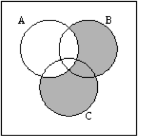

b) 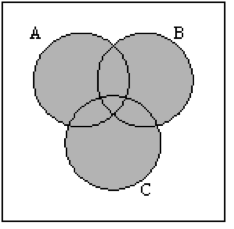

c) 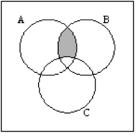

d) 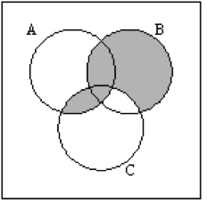

---

**5.** Écris l'ensemble des parties (tous les sous-ensembles) des ensembles suivants.

a) $A = \{\,\}$ &ensp; b) $A = \{a\}$ &ensp; c) $A = \{a,b\}$ &ensp; d) $A = \{a,b,c\}$

**6.** Soit $G$ l'ensemble de tous les habitants d'une ville, $M$ l'ensemble de tous les habitants masculins, $V$ l'ensemble des habitants de plus de 60 ans (les « vieux ») et $A$ l'ensemble de tous les habitants dont les parents habitaient déjà dans cette ville (les « autochtones »).

a) Écris les ensembles suivants à l'aide des opérations sur les ensembles.
   1. L'ensemble des vieux non autochtones.
   2. L'ensemble des habitants féminins.
   3. L'ensemble des habitants de moins de 60 ans.
   4. L'ensemble des autochtones masculins.
   5. L'ensemble des vieux masculins.

b) Décris les ensembles suivants avec des mots.
   1. $V \cap M$
   2. $V \setminus M$
   3. $A \cap M$
   4. $V \cup (A \setminus M)$
   5. $V \cup M$
   6. $M \setminus (V \cap A)$

**7.** Dans un hôpital sont 200 patients. 50 ont des problèmes respiratoires, 60 des problèmes cardiaques et 30 du rhumatisme. 15 patients ont des problèmes cardiaques et respiratoires, 10 patients ont du rhumatisme et des problèmes cardiaques. Parmi les patients avec du rhumatisme 5 ont aussi un problème respiratoire. Aucune personne souffre des trois maladies. Établis un diagramme de Venn et réponds aux questions suivantes.

a) Combien de patients n'ont qu'une seule maladie ? Laquelle ?

b) Combien de patients sont dans l'hôpital pour d'autres maladies ?

**8.** Soit $D_n$ l'ensemble des diviseurs de $n$ et $M_n$ l'ensemble des multiples de $n$. Énumère les ensembles suivants (définis en extension).

a) $D_{12} \cap D_{18}$ &ensp; b) $D_{30} \setminus D_{15}$ &ensp; c) $M_2 \cap M_4$ &ensp; d) $M_6 \setminus M_9$ &ensp; e) $D_{10} \cup D_{35}$ &ensp; f) $M_3 \cup M_6$ &ensp; g) $D_{24} \cap M_3$ &ensp; h) $M_3 \setminus D_{36}$

**9.** Soit l'ensemble de base $M = \{a,b,c,d,e,f,g,h,i,j,k,l\}$ et les deux sous-ensembles $A = \{b,c,d,f,h\}$ et $B = \{b,h,j\}$. Montre à l'aide de ces ensembles l'égalité suivante : $\overline{(A \cup B)} = \overline{A} \cap \overline{B}$.

---

**10.** Lors d'une étude sur les voyages des collégiens en Europe, 363 élèves ont été interrogés sur leurs voyages en Espagne, Angleterre et Italie. 180 élèves ont séjourné en Espagne, 192 en Angleterre, 199 en Italie. 103 élèves ont au moins séjourné en Espagne et en Angleterre, 105 au moins en Italie et en Angleterre et 123 au moins en Italie et en Espagne. 73 élèves ont déjà séjourné dans les 3 pays. Établis un diagramme de Venn et réponds aux questions suivantes :

a) Déterminer le nombre d'élèves qui ont séjourné uniquement en Espagne.

b) Déterminer le nombre d'élèves qui ont séjourné uniquement en Italie et en Angleterre.

c) Déterminer le nombre d'élèves qui n'ont séjourné dans aucun de ces 3 pays.

**11\*.** Lors d'une exposition, des bijoux ont été volés. La police interroge 18 personnes et pose deux questions auxquelles les personnes doivent répondre par « Oui » ou « Non ». Les questions sont :

- Avez-vous entendu du verre se casser ?
- Avez-vous vu fuir quelqu'un ?

Dix personnes ont répondu « Oui » à la première question, six personnes ont répondu « Non » à la deuxième question et 5 personnes ont répondu « Non » aux deux questions. Établis un diagramme de Venn qui illustre cette situation et détermine combien de personnes ont répondu « Oui » aux deux questions.

**12\*.** Explique/Démontre pourquoi un ensemble de $n$ éléments possède exactement $2^n$ sous-ensembles.

---

## 1.4 Solutions

**1.**

a) $A \cup C = \{1;2;3;4;5;6;7;8;12\}$

b) $A \setminus B = \{2;4;6;8\}$

c) $A \cap B = \{1;3;5;7\}$

d) $C \cap B = \varnothing$

e) $C \cup B = \{1;2;3;4;5;7;8;12\}$

f) $C \setminus A = \{12\}$

**2.**

a) Faux &ensp; b) Vrai

**3.** Solution en classe.

**4.** Pas de solution unique. Voici des solutions possibles.

a) $(B \cup C) \setminus A$ &ensp; b) $A \cup B \cup C$ &ensp; c) $(A \cap B) \setminus C$ &ensp; d) $(B \setminus C) \cup (A \cap C)$

**5.**

a) $\mathcal{P}(A) = \{\varnothing\}$

b) $\mathcal{P}(A) = \{\varnothing, \{a\}\}$

c) $\mathcal{P}(A) = \{\varnothing, \{a\}, \{b\}, \{a,b\}\}$

d) $\mathcal{P}(A) = \{\varnothing, \{a\}, \{b\}, \{c\}, \{a,b\}, \{a,c\}, \{b,c\}, \{a,b,c\}\}$

**6.** Exercice a) :

1. $V \setminus A$ ou $V \cap \overline{A}$
2. $G \setminus M$ ou $\overline{M}$
3. $G \setminus V$ ou $\overline{V}$
4. $M \cap A$
5. $M \cap V$

Exercice b) :
1. Ensemble des hommes vieux.
2. Ensemble des femmes vieilles.
3. Ensemble des hommes autochtones.
4. Ensemble des habitants qui sont vieux ou des femmes autochtones.
5. Ensemble des habitants vieux ou masculins.
6. Ensemble des hommes sans les vieux autochtones.

**7.**

a) Il y a 35 patients avec que des problèmes cardiaques, 30 patients avec que des problèmes respiratoires et 15 avec que du rhumatisme.

b) 90 patients.

**8.**

a) $\{1;2;3;6\}$ &ensp; b) $\{2;6;10;30\}$ &ensp; c) $\{4;8;12;16;20;\ldots\}$ &ensp; d) $\{6;12;24;30;42;48;60;\ldots\}$

e) $\{1;2;5;7;10;35\}$ &ensp; f) $\{3;6;9;12;15;\ldots\}$ &ensp; g) $\{3;6;12;24\}$ &ensp; h) $\{15;21;24;27;30;33;39;42;45;\ldots\}$

**9.** $A \cup B = \{b;c;d;f;h;j\} \Longrightarrow \overline{(A \cup B)} = \{a;e;g;i;k;l\}$

$\overline{A} = \{a;e;g;i;j;k;l\}$, $\overline{B} = \{a;c;d;e;f;g;i;k;l\}$ $\Longrightarrow \overline{A} \cap \overline{B} = \{a;e;g;i;k;l\}$

**10.**

a) 27 élèves. &ensp; b) 32 élèves. &ensp; c) 50 élèves.

**11\*.** Solution en classe.

**12\*.** Solution en classe.

---

# 2. Nombres

## 2.1 Découvrir

Pour écrire les nombres et faire des calculs, nous utilisons le système décimal, c'est-à-dire les puissances de 10.

**Exemple :** Le nombre $2\,974$ signifie $2 \cdot 10^3 + 9 \cdot 10^2 + 7 \cdot 10^1 + 4 \cdot 10^0$

La virgule marque la frontière entre la partie entière et la partie non-entière d'un nombre. Les chiffres après la virgule représentent les puissances de 10 avec exposants négatifs.

**Exemple :** Le nombre $4{,}561$ signifie $4 \cdot 10^0 + 5 \cdot 10^{-1} + 6 \cdot 10^{-2} + 1 \cdot 10^{-3}$

Les Babyloniens utilisaient le système sexagésimal pour écrire leurs nombres, c'est-à-dire qu'ils regroupaient leurs nombres à l'aide des puissances de 60. Pour cela ils utilisaient les symboles suivants pour écrire leurs chiffres de 1 à 59 :

La position à laquelle est placé le chiffre babylonien indique la puissance de 60 concernée, exactement comme dans notre système décimal.

**Exemples :**

a) 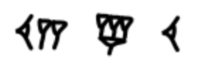 $= 12 \cdot 60^2 + 4 \cdot 60^1 + 10 \cdot 60^0 = 12 \cdot 3600 + 4 \cdot 60 + 10 \cdot 1 = 43\,450$

b) 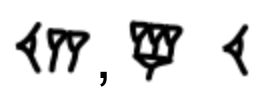 $= 12 \cdot 60^0 + 4 \cdot \dfrac{1}{60} + 10 \cdot \dfrac{1}{60^2} = \dfrac{43\,450}{3600} = 12{,}069\overline{4}$

---

La tablette d'argile ci-contre (Yale Babylonian Collection, no 7289) est une pièce archéologique de la période paléo-babylonienne traitant plusieurs sujets mathématiques importants. On estime son âge à $3\,700$ ans. Dessous se trouve une illustration simplifiée pour mieux déchiffrer les symboles se trouvant sur cette tablette, les virgules ont été rajoutées et ne figurent pas sur la tablette originale.

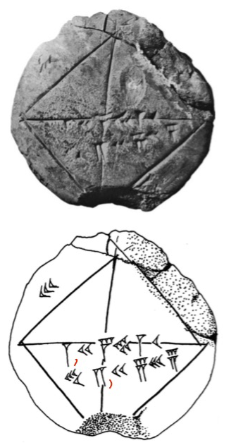

a) Quel nombre se cache derrière le symbole 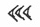 ?

b) Que valent les nombres 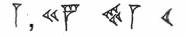 et 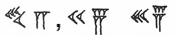 dans notre système décimal (arrondi à 6 chiffres après la virgule) ?

c) Quel est le rapport entre ces trois nombres ?

---

d) Sur la tablette d'argile est illustré un carré dont la longueur des côtés vaut $30$. Que vaut la longueur $x$ de la diagonale d'un tel carré (voir figure) ? Que constates-tu par rapport aux nombres sur la tablette d'argile babylonienne ?

e) Que vaut la longueur $y$ de la diagonale dans le carré unité, c'est-à-dire le carré dont les côtés ont une longueur de $1$.

f) Comment peut-on utiliser le résultat de l'exercice e) pour déterminer la longueur $d$ de la diagonale d'un carré quelconque dont les côtés ont une longueur de $k$.

---

## 2.2 Théorie

Il est fort probable que l'être humain ait développé des compétences mathématiques avant l'apparition de l'écriture. Il est impossible de dire pourquoi et à quel moment les humains ont commencé à compter, mais nous pensons que les humains savent compter depuis environ $50\,000$ ans.

L'os d'Ishango, découvert dans les années 50 en Afrique et daté d'environ $20\,000$ ans, est un objet qui prouve quasi sans doute que les humains de cette époque connaissaient les règles de l'arithmétique élémentaire (la science des nombres). Sur cet os on trouve plusieurs incisions groupées dans trois colonnes. Dans la première colonne on trouve les paires $(3;6)$, $(4;8)$, $(5;10)$ et à la fin les deux nombres premiers $5$ et $7$. Dans la deuxième colonne on trouve les nombres $11$, $13$, $17$ et $19$ qui sont les nombres premiers entre $10$ et $20$. La somme de cette colonne vaut $60$. La somme de la troisième colonne, où se trouvent les nombres $11$, $21$, $19$ et $9$ (les valeurs $10 \pm 1$ et $20 \pm 1$), vaut aussi $60$.

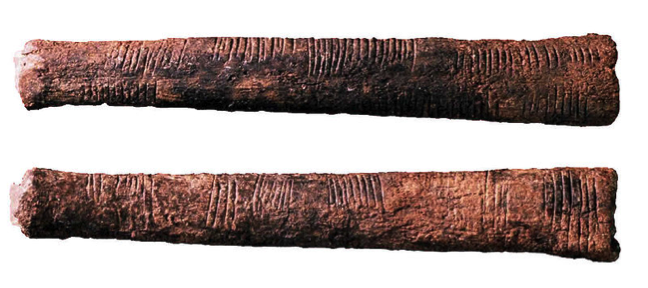

*L'os d'Ishango.*

Le développement des mathématiques en tant que connaissance transmise dans les premières civilisations est lié à leurs applications concrètes : le commerce, la gestion des récoltes, la mesure des surfaces, la prédiction des événements astronomiques, le calendrier et parfois l'exécution de rituels religieux. C'est ainsi que naît peu à peu l'arithmétique :

- L'unité (un sac de blé)
- L'inégalité (ce sac est plus grand que celui-là)
- L'égalité
- La suite des nombres naturels
- Les opérations sur ces nombres

L'ensemble des nombres avec lesquels tout enfant commence à compter est appelé l'**ensemble des nombres naturels**. La notation mathématique de cet ensemble est $\mathbb{N}$ et défini en extension on obtient

$$\mathbb{N} = \{1,2,3,4,5,\ldots\}.$$

Souvent le zéro est compté comme étant un nombre naturel, dans ce cas on a

$$\mathbb{N} = \{0,1,2,3,4,5,\ldots\}.$$

**Exemple :** Le nombre $3$ est un nombre naturel, on écrit $3 \in \mathbb{N}$. Par contre $\frac{2}{3}$ n'est pas un nombre naturel, donc $\frac{2}{3} \notin \mathbb{N}$.

Ni les Égyptiens, ni les Grecs ou les Romains ne connaissaient le zéro et les entiers négatifs. L'usage moderne du nombre zéro est probablement l'héritage du mathématicien et astronome indien *Brahmagupta*, qui fût le premier à définir le zéro au 7ème siècle. Son nouveau système permit également de considérer les nombres négatifs. Avec l'essor du commerce, les nombres positifs et négatifs sont interprétés comme un bénéfice ou une dette.

Ce nouvel ensemble de nombres, contenant les entiers positifs, les entiers négatifs et le zéro, est appelé l'**ensemble des nombres entiers**, qu'on note $\mathbb{Z}$. Défini en extension on obtient

$$\mathbb{Z} = \{\ldots,-3,-2,-1,0,1,2,3,\ldots\}$$

> **Remarque**
>
> Il est facile de constater que tout nombre naturel est aussi un nombre entier. L'ensemble $\mathbb{N}$ est donc un sous-ensemble de $\mathbb{Z}$ et mathématiquement on écrit $\mathbb{N} \subset \mathbb{Z}$. Autrement dit, si un nombre $x$ appartient à $\mathbb{N}$ il appartient aussi à $\mathbb{Z}$.

Pour les Grecs, les nombres avaient avant tout une signification géométrique. On mesurait des longueurs, des aires ou des volumes. C'est pour cette raison que les nombres négatifs ou le zéro n'avaient aucune importance. Mais la géométrie donna lieu à l'établissement de nombreux rapports entre les longueurs et les caractéristiques géométriques. Ceci mena à l'introduction des nombres rationnels (les fractions). Un exemple connu est le théorème de Thalès, qui affirme que les rapports des côtés de triangles semblables sont égaux.

---

*Le théorème de Thalès affirme que $\dfrac{\overline{AB}}{\overline{AC}} = \dfrac{\overline{AD}}{\overline{AE}}$*

Donc les grecs connaissaient non seulement les nombres naturels, mais aussi les fractions positives. Une fraction est une division

$$\dfrac{p}{q},$$

entre deux nombres entiers $p$ et $q$ où $q$ différent de zéro, car la division par zéro n'est pas définie. L'ensemble de toutes les fractions (positives et négatives) est appelé l'**ensemble des nombres rationnels** et on le note $\mathbb{Q}$. Il est difficile d'énumérer cet ensemble, c'est pour cela qu'on le définit en « compréhension »

$$\mathbb{Q} = \left\{\frac{p}{q} \;\middle|\; p,q \in \mathbb{Z} \text{ et } q \neq 0 \right\}.$$

Les fractions ont un développement décimal particulier.

> **Théorème**
>
> Toute fraction est un nombre décimal fini ou périodique. Réciproquement tout nombre décimal fini ou périodique est une fraction.

**Exemples :**

a) $0.75 = \frac{3}{4}$ &ensp; b) $\frac{7}{3} = 2.\overline{3}$ &ensp; c) $2.\overline{714285} = \frac{19}{7}$ &ensp; d) $\frac{9}{22} = 0.40\overline{90}$

Pour transformer une fraction en nombre décimal et un nombre décimal (fini ou périodique) en une fraction il faut utiliser quelques petites astuces.

---

**Fraction $\longrightarrow$ Nombre décimal :**

**Nombre décimal $\longrightarrow$ Fraction :**

---

> **Remarque**
>
> Étant donné que tout nombre entier $x \in \mathbb{Z}$ peut aussi être représenté comme fraction $\dfrac{x}{1}$, les nombres entiers $\mathbb{Z}$ sont un sous-ensemble des nombres rationnels $\mathbb{Q}$ et on écrit $\mathbb{Z} \subset \mathbb{Q}$.

À ce stade il serait sûrement judicieux de répéter le calcul avec les fractions. On représente souvent les fractions à l'aide de pizzas ou de gâteaux.

| | |
|:---:|:---:|
|  |  |
| *$\dfrac{3}{4}$ d'une pizza* | *$\dfrac{5}{8}$ d'une pizza* |

La valeur d'une fraction ne change pas si on multiplie le **numérateur** et le **dénominateur** avec le même nombre (on appelle ceci **amplifier**) ou qu'on les divise par un diviseur commun (on appelle ceci **simplifier**).

.png)

---

**Addition et soustraction**

Pour additionner ou soustraire des fractions il faut tout d'abord les mettre au même dénominateur. Pour cela on cherche en général le plus petit multiple commun des dénominateurs et amplifie de façon adéquate.

**Multiplication**

Pour multiplier deux fractions entre elles, on multiplie les dénominateurs entre eux et les numérateurs entre eux. On simplifie si possible en verticale et en diagonale **avant** d'effectuer la multiplication.

**Division**

Pour effectuer une division entre deux fractions on inverse le diviseur (deuxième fraction) et on effectue une multiplication.

---

> **Remarque**
>
> Une double fraction n'est rien d'autre qu'une division entre deux fractions !

**Puissances**

La puissance d'une fraction n'est rien d'autre que la fraction des puissances.

Nous avons donc vu que toutes les fractions sont des nombres décimaux soit finis soit périodiques et réciproquement. Mais il existe des nombres décimaux qui ne sont ni finis ni périodiques, comme par exemple $1.1010010001000010000010000001\ldots$, $\pi$ ou $\sqrt{2}$ (vu dans l'exercice d'introduction). En ajoutant ces nombres aux rationnels, on obtient tous les nombres décimaux. Cet ensemble est appelé l'**ensemble des nombres réels** et on l'abrège avec le symbole $\mathbb{R}$. L'ensemble des nombres réels est souvent illustré par une droite graduée, appelée la **droite réelle**.

*Sur la droite réelle sont situés tous les nombres décimaux.*

> **Remarque**
>
> Comme tout nombre rationnel est un nombre décimal on a $\mathbb{Q} \subset \mathbb{R}$. Au final on obtient $\mathbb{N} \subset \mathbb{Z} \subset \mathbb{Q} \subset \mathbb{R}$ (voir diagramme ci-dessous).

---

*Les quatre ensembles de nombres.*

Les règles de calcul pour les nombres réels sont traitées à l'école primaire et secondaire. Voici un petit rappel. Soient $a$, $b$ et $c$ des nombres réels :

- **Commutativité**
  $$a+b = b+a \quad \text{et} \quad a \cdot b = b \cdot a$$

- **Associativité**
  $$(a+b)+c = a+(b+c) \quad \text{et} \quad (a \cdot b) \cdot c = a \cdot (b \cdot c)$$

- **Distributivité**
  $$a \cdot (b+c) = a \cdot b + a \cdot c$$

- **Éléments neutres**
  $$a+0 = a \quad \text{et} \quad a \cdot 1 = a$$

- **Éléments symétriques**
  $$a+(-a) = 0 \quad \text{et} \quad a \cdot \frac{1}{a} = 1$$
  
  Le nombre $-a$ est appelé l'**opposé** de $a$ et $\dfrac{1}{a}$ est appelé l'**inverse** de $a$.

- **Hiérarchie des opérations**
  1. Parenthèses
  2. Puissances et racines
  3. Multiplications et divisions
  4. Additions et soustractions

**Exemple :** $2 \cdot (5+3)^2 + 1 = 2 \cdot 8^2 + 1 = 2 \cdot 64 + 1 = 128 + 1 = 129$

---

> **Remarque**
>
> La structure d'expressions mathématiques peut être illustrée à l'aide de rectangles et d'ellipses :
>
> - Si deux expressions sont séparées par une addition ou une soustraction, alors on les place dans des rectangles.
> - Si deux expressions sont séparées par une multiplication, une division ou une puissance, alors on les place dans des ellipses.
>
> Cette représentation peut aider pour mieux comprendre l'ordre dans lequel il faut calculer et pour fractionner un grand calcul en plusieurs petits calculs.

---

## 2.3 Exercices

**1.** Complète le tableau par **vrai** ou **faux**

| | $x=-\frac{2}{3}$ | $x=\sqrt{9}$ | $x=\sqrt{3}$ | $x=0.45324$ | $x=-7$ |
|---|:---:|:---:|:---:|:---:|:---:|
| $x \in \mathbb{N}$ | | | | | |
| $x \in \mathbb{Z}$ | | | | | |
| $x \in \mathbb{Q}$ | | | | | |
| $x \in \mathbb{R}$ | | | | | |

**2.** Lesquels de ces nombres sont placés au mauvais endroit ? Corrige !

**3.** Réponds aux questions suivantes :

a) Tous les nombres entiers sont rationnels. Vrai ou faux ?

b) À quels ensembles de nombres appartient le nombre $1.345$ ?

c) Quels ensembles de nombres contiennent le nombre $-2$ ?

d) $-11$ est un nombre naturel. Vrai ou faux ?

e) $\pi$ est un nombre rationnel. Vrai ou faux ?

f) $1.\overline{45}$ est un nombre réel ? Vrai ou faux ?

**4.** Résous les exercices suivants sans calculatrice :

a) $\left(12 + \dfrac{7}{4} - 1\right)\left(\dfrac{1}{2} - \dfrac{1}{3}\right)\left(\dfrac{2}{5} - 1\right) - (-3)\left(\dfrac{5}{3} - \dfrac{9}{4}\right)\left(2 + \dfrac{6}{7}\right) =$

b) $\dfrac{3}{2} - \dfrac{2}{3}\left(-\dfrac{3}{4} - \left(\dfrac{1}{2} - \left(\dfrac{2}{3} - 1\right)\right)\right) =$

c) $\left(4 - \dfrac{2}{5} + \dfrac{4}{3} - \dfrac{2}{3}\right) : \left(-3 - 3 \cdot \dfrac{1}{2} - \dfrac{4}{5} + 2\right) =$

---

**5.** Résous sans calculatrice.

a) $12 + 4 \cdot 3 + 2 =$

b) $(12+4) \cdot 3 + 2 =$

c) $3 \cdot 5 + (2 \cdot 4 - 2) \cdot 6 =$

d) $(7-2)^2 : 5 \cdot 2^3 =$

e) $3 \cdot (2-7) \cdot (-1) - (6-9)^3 - 2^3 + 1 =$

f) $\dfrac{5-(2-8) \cdot 2}{2 \cdot (6+3) - 1} =$

g) $9 + 3 \cdot (2 \cdot (9-5) - (5-7)) =$

h) $\sqrt{36+64} =$

i) $\sqrt{36} + \sqrt{64} =$

**6.** Place entre le nombre et l'ensemble $\in$ ou $\notin$.

a) $-2 \quad \mathbb{N}$ &ensp; b) $101 \quad \mathbb{N}$ &ensp; c) $-7 \quad \mathbb{Z}$ &ensp; d) $-\frac{3}{5} \quad \mathbb{Z}$ &ensp; e) $\sqrt{5} \quad \mathbb{R}$ &ensp; f) $\frac{3}{4} \quad \mathbb{R}$

g) $1.345 \quad \mathbb{Q}$ &ensp; h) $\sqrt{81} \quad \mathbb{Z}$ &ensp; i) $4.\overline{234} \quad \mathbb{Q}$ &ensp; j) $\sqrt{3} \quad \mathbb{Q}$ &ensp; k) $\pi \quad \mathbb{R}$ &ensp; l) $10009 \quad \mathbb{R}$

**7.** Les ensembles suivants sont définis en compréhension. Écris-les en extension.

a) $\{x \in \mathbb{Z} \mid -5 \leq x \leq 5\}$

b) $\{x \in \mathbb{N} \mid x \text{ est un multiple de } 6\}$

c) $\{x \in \mathbb{Z} \mid x^2 \leq 40\}$

d) $\{x \in \mathbb{N} \mid x \text{ est un diviseur de } 24\}$

e) $\left\{x = \frac{p}{q} \;\middle|\; -3 \leq x \leq 2,\; p \in \mathbb{Z},\; q = 3\right\}$

**8.** Représente les ensembles suivants à l'aide des symboles $\mathbb{N}$, $\mathbb{Z}$, $\mathbb{Q}$, $\mathbb{R}$, $\cup$, $\cap$, $\setminus$ et $\{\;\}$.

a) L'ensemble des nombres réels qui ne sont pas entiers.

b) L'ensemble des nombres entiers sans le $-3$ et le $7.5$.

c) L'ensemble des nombres réels qui sont strictement supérieurs à $5$.

d) L'ensemble des nombres réels dont la racine carrée est plus petite ou égale à $20$.

e) L'ensemble des nombres réels entre $-25$ et $8$.

f)* L'ensemble des nombres pairs.

g)* L'ensemble des nombres impairs.

---

**9.** Écris les fractions suivantes comme nombres décimaux (sans calculatrice).

a) $\dfrac{13}{5}=$ &ensp; b) $\dfrac{5}{6}=$ &ensp; c) $\dfrac{7}{4}=$ &ensp; d) $\dfrac{8}{3}=$ &ensp; e) $\dfrac{7}{11}=$ &ensp; f) $\dfrac{8}{13}=$ &ensp; g) $\dfrac{9}{7}=$ &ensp; h) $\dfrac{133}{20}=$ &ensp; i) $\dfrac{785}{60}=$

**10.** Écris les nombres décimaux comme fractions.

a) $0.62=$ &ensp; b) $2.345=$ &ensp; c) $0.\overline{7}=$ &ensp; d) $1.0\overline{83}=$ &ensp; e) $5.\overline{135}=$ &ensp; f) $2.4\overline{2}=$

**11.** Résous les exercices suivants et simplifie le plus possible (sans calculatrice).

a) $\dfrac{1}{8} + \dfrac{2}{3} + \dfrac{1}{2} =$

b) $\dfrac{1}{2} + \dfrac{2}{3} + \dfrac{3}{4} =$

c) $\dfrac{1}{10} + \dfrac{1}{100} + \dfrac{1}{1000} =$

d) $\dfrac{3}{2} \cdot \left(\dfrac{2}{5} + \dfrac{5}{2}\right) =$

e) $1 + \dfrac{1}{3} \cdot \dfrac{4}{5} - 3 =$

f) $\left(\dfrac{1}{3} + \dfrac{1}{2}\right) : \left(\dfrac{1}{4} + \dfrac{1}{5}\right) =$

g) $\left(\dfrac{1}{5} + \dfrac{5}{3}\right)^2 =$

h) $\dfrac{1}{1+\dfrac{1}{2+\frac{1}{3}}} =$

i) $\dfrac{1}{4-\dfrac{1}{3+\frac{2}{5}}} =$

**12.** Représente les expressions suivantes à l'aide de rectangles et d'ellipses.

a) $a + bc + \dfrac{c}{a+b}$ &ensp; b) $\dfrac{a+b}{c} \cdot d + a$ &ensp; c) $(a+b) \cdot c + ac^3$

**13.** Détermine une expression qui correspond à la structure donnée.

a) 

b) 

---

**14.** Détermine l'expression mathématique qui correspond à la description suivante :

- L'expression est une différence.
- Le *diminuende* (nombre duquel on va soustraire le diminuteur) est un produit qui possède les facteurs $a$ et $b$.
- Le *diminuteur* (nombre retranché du diminuende) est un quotient.
- Le numérateur de ce quotient est un produit dont le premier facteur est $5$ et dont le deuxième facteur est une somme avec les termes $a$ et $b$.
- Le dénominateur de ce quotient est le produit des facteurs $c$ et $d$.

**15\*.** Résous les exercices suivants et simplifie le plus possible (sans calculatrice).

a) $\dfrac{18}{5} : \dfrac{14}{3} - \dfrac{8}{15} =$

b) $\dfrac{51}{4} : \dfrac{21}{2} - \dfrac{2}{15} \cdot \dfrac{20}{7} =$

c) $\left(\dfrac{4}{7} - \dfrac{3}{14}\right) \cdot \left(\dfrac{1}{3} + \dfrac{3}{5}\right) =$

d) $\dfrac{4}{5} : 2 - \dfrac{2}{5} : \dfrac{10}{3} =$

e) $\dfrac{11}{5} \cdot \left(\dfrac{11}{6} + \dfrac{2}{3}\right) =$

f) $\dfrac{5}{8} : \dfrac{1}{4} - \dfrac{5}{4} =$

**16\*.** Résous les exercices suivants et simplifie le plus possible (sans calculatrice).

a) $\dfrac{\dfrac{5}{2}+\dfrac{13}{4}}{\dfrac{1}{2}} =$

b) $\dfrac{\dfrac{7}{5}-\dfrac{5}{7}}{\dfrac{3}{2}-\dfrac{2}{3}} =$

c) $\dfrac{\dfrac{5}{4}+\dfrac{1}{6}}{\dfrac{5}{12}+1} =$

d) $\dfrac{\dfrac{42}{5}-\dfrac{2}{3}}{\dfrac{7}{4}+\dfrac{11}{2}} =$

---

## 2.4 Solutions

**1.**

| | $x=-\frac{2}{3}$ | $x=\sqrt{9}$ | $x=\sqrt{3}$ | $x=0.45324$ | $x=-7$ |
|---|:---:|:---:|:---:|:---:|:---:|
| $x \in \mathbb{N}$ | Faux | Vrai | Faux | Faux | Faux |
| $x \in \mathbb{Z}$ | Faux | Vrai | Faux | Faux | Vrai |
| $x \in \mathbb{Q}$ | Vrai | Vrai | Faux | Vrai | Vrai |
| $x \in \mathbb{R}$ | Vrai | Vrai | Vrai | Vrai | Vrai |

**2.**

**3.**

a) Vrai &ensp; b) $\mathbb{Q}$ et $\mathbb{R}$ &ensp; c) $\mathbb{Z}$, $\mathbb{Q}$ et $\mathbb{R}$ &ensp; d) Faux &ensp; e) Faux &ensp; f) Vrai

**4.**

a) $-\dfrac{251}{40}$ &ensp; b) $\dfrac{23}{9}$ &ensp; c) $-\dfrac{128}{99}$

**5.**

a) $26$ &ensp; b) $50$ &ensp; c) $51$ &ensp; d) $40$ &ensp; e) $35$ &ensp; f) $1$ &ensp; g) $39$ &ensp; h) $10$ &ensp; i) $14$

**6.**

a) $-2 \notin \mathbb{N}$ &ensp; b) $101 \in \mathbb{N}$ &ensp; c) $-7 \in \mathbb{Z}$ &ensp; d) $-\frac{3}{5} \notin \mathbb{Z}$ &ensp; e) $\sqrt{5} \in \mathbb{R}$ &ensp; f) $\frac{3}{4} \in \mathbb{R}$

g) $1.345 \in \mathbb{Q}$ &ensp; h) $\sqrt{81} \in \mathbb{Z}$ &ensp; i) $4.\overline{234} \in \mathbb{Q}$ &ensp; j) $\sqrt{3} \notin \mathbb{Q}$ &ensp; k) $\pi \in \mathbb{R}$ &ensp; l) $10009 \in \mathbb{R}$

Pour j) : La racine carrée d'un nombre naturel est toujours un nombre naturel ou un nombre irrationnel !

---

**7.**

a) $\{-5;-4;-3;-2;-1;0;1;2;3;4;5\}$

b) $\{6;12;18;24;30;\ldots\}$

c) $\{-6;-5;-4;-3;-2;-1;0;1;2;3;4;5;6\}$

d) $\{1;2;3;4;6;8;12;24\}$

e) $\left\{-\frac{9}{3};-\frac{8}{3};-\frac{7}{3};-\frac{6}{3};\ldots;\frac{4}{3};\frac{5}{3};\frac{6}{3}\right\}$

**8.**

a) $\mathbb{R} \setminus \mathbb{Z}$

b) $\mathbb{Z} \setminus \{-3;7.5\}$

c) $\{x \in \mathbb{R} \mid x > 5\}$

d) $\{x \in \mathbb{R} \mid \sqrt{x} \leq 20\}$

e) $\{x \in \mathbb{R} \mid -25 \leq x \leq 8\}$

f) $\{x = 2k \mid k \in \mathbb{Z}\}$

g) $\{x = 2k+1 \mid k \in \mathbb{Z}\}$

**9.**

a) $2.6$ &ensp; b) $0.8\overline{3}$ &ensp; c) $1.75$ &ensp; d) $2.\overline{6}$ &ensp; e) $0.\overline{63}$ &ensp; f) $0.\overline{615384}$ &ensp; g) $1.\overline{285714}$ &ensp; h) $6.65$ &ensp; i) $13.08\overline{3}$

**10.**

a) $\dfrac{31}{50}$ &ensp; b) $\dfrac{469}{200}$ &ensp; c) $\dfrac{7}{9}$ &ensp; d) $\dfrac{1073}{990}$ &ensp; e) $\dfrac{570}{111}$ &ensp; f) $\dfrac{109}{45}$

**11.**

a) $\dfrac{31}{24}$ &ensp; b) $\dfrac{23}{12}$ &ensp; c) $\dfrac{111}{1000}$ &ensp; d) $\dfrac{87}{20}$ &ensp; e) $-\dfrac{26}{15}$ &ensp; f) $\dfrac{50}{27}$ &ensp; g) $\dfrac{784}{225}$ &ensp; h) $\dfrac{7}{10}$ &ensp; i) $\dfrac{17}{63}$

**12.** Solution en classe.

**13.** Solution individuelle ! Voici quelques possibilités.

a) $(a+b) - c \cdot \dfrac{b}{a}$ &ensp; b) $\left(a \cdot b + \dfrac{b}{a}\right) \cdot d + b$

**14.** $a \cdot b - \dfrac{5(a+b)}{c \cdot d}$

**15\*.**

a) $\dfrac{5}{21}$ &ensp; b) $\dfrac{5}{6}$ &ensp; c) $\dfrac{1}{3}$ &ensp; d) $\dfrac{7}{25}$ &ensp; e) $\dfrac{11}{2}$ &ensp; f) $\dfrac{5}{4}$

**16\*.** Compare tes résultats avec tes camarades de classe.

---

# 3. Équations

## 3.1 Découvrir

Détermine le nombre $x$ avec lequel l'équation est vraie ? Explique ta démarche.

a) $4x + 5 = 13$

b) $3(x+2) = 2x-1$

c) $3x - 7 = -\dfrac{5}{2}x + \dfrac{5}{4}$

Essaye de résoudre les équations suivantes.

a) $2(x+15) = 8x + 30 - 6x$

b) $16 - 36x = -3(12x+1)$

Que constates-tu ?

---

**Deux voyages arithmétiques :**

1. Choisis un nombre, additionne $8$, divise par $2$, soustrait la moitié du nombre initial. Quel est le nombre que tu obtiens au final ?

   Compare ton résultat avec celui de tes collègues de classe. Que constatez-vous ?

   Essaye d'exprimer ce voyage arithmétique par une expression mathématique et explique pourquoi tout le monde obtient le même résultat final.

2. Choisis un nombre, additionne $8$, divise par $2$, mets au carré. Quel est le nombre que tu obtiens au final ?

   Compare ton résultat avec celui de tes collègues de classe. Que constatez-vous ?

   Quel nombre faut-il choisir au départ pour que le voyage se termine avec $100$, $-40$, $\frac{4}{5}$, $\sqrt{3}$ ?

   Quels nombres faut-il choisir au départ pour que le résultat final du voyage soit un nombre naturel ?

**Deux problèmes :**

1. Trois amis collectionnent des BD. John possède trois fois plus de BD que Ben. Mandy possède 10 BD de moins que Ben. Ensemble ils en ont 100 BD. Tu aimerais déterminer le nombre de BD que chacun possède. Laquelle de ces équations te permettra de trouver la bonne solution ? Que représente la lettre $x$ ?

   ☐ $3x - 10 = 100$

   ☐ $3x + (x-10) = 100$

   ☐ $x = \dfrac{100+10}{5}$

   ☐ $x + 3x + (x-10) = 100$

2. La location d'un court de tennis pendant une heure coûte CHF 28.- dans le centre de tennis $A$. Le centre de tennis $B$ demande une taxe forfaitaire annuelle de CHF 200.-, ensuite l'heure de tennis ne coûte que CHF 18.-.

   a) Quel centre de tennis choisirais-tu pour jouer ?

   b) Détermine une formule pour chaque centre qui calcule le coût total pour jouer du tennis en fonction des heures $x$ passées sur un court.

   c) Pour quel nombre d'heures les deux centres ont le même coût ?

---

## 3.2 Théorie

En mathématiques on parle d'une **équation** quand deux expressions sont liées par une égalité.

$$E_g = E_d$$

L'expression $E_d$ est appelée l'expression de droite et l'expression $E_g$ est appelée l'expression de gauche de l'équation. Une équation possède en général une ou plusieurs **inconnue(s)**, représentée(s) normalement par des lettres minuscules. Ces inconnues représentent des nombres et résoudre une équation correspond à trouver les valeurs de ces nombres (inconnus), telles que l'équation soit vraie. Ces valeurs sont regroupées dans l'**ensemble des solutions** $S$. Pour l'instant nous allons traiter des équations à une seule inconnue.

Pour résoudre une équation on n'utilise (si possible) que des **règles d'équivalence**, c.-à-d. qu'on transforme l'équation sans modifier son ensemble des solutions. Les trois règles d'équivalence sont :

1. effectuer un calcul.
2. additionner ou soustraire une même expression de chaque côté de l'équation.
3. multiplier ou diviser chaque côté de l'équation par le même nombre, et ce nombre **doit être** différent de zéro.

---

Dans ce chapitre nous allons surtout traiter des équations du premier degré.

> **Définition**
>
> Une équation **du premier degré** à une inconnue est une équation où l'inconnue n'est qu'à la puissance 1. L'inconnue n'est donc ni au dénominateur, ni sous une racine, ni au carré, au cube, etc. Une telle équation peut toujours être ramenée à la forme suivante
> $$ax = b$$
> où $a$ et $b$ sont des nombres réels et $x$ est l'inconnue.

Les équations du premier degré peuvent toujours être résolues grâce aux trois transformations d'équivalence et possèdent en général qu'une seule solution. Il existe néanmoins deux cas particuliers :

- Si on obtient au final l'équation
  $$0 = 0$$
  alors l'équation est **indéterminée**. Dans ce cas, tout nombre est solution de l'équation et on écrit
  $$S = \mathbb{R}$$

---

- Si on obtient au final l'équation
  $$0 = a \text{ où } a \neq 0$$
  alors l'équation est **impossible**, on écrit
  $$S = \varnothing \text{ ou } S = \{\,\}$$

Il existe d'autres transformations, comme par exemple la mise au carré ou la multiplication par une expression contenant l'inconnue. Celles-ci sont nécessaires pour transformer d'autres équations (p.ex. une équation avec racine ou une équation rationnelle) en équation du premier degré. En utilisant des transformations qui ne sont pas d'équivalence il faut être critique avec les solutions obtenues. Parfois certaines solutions obtenues ne peuvent même pas être insérées dans l'équation initiale car celle-ci ne ferait plus sens. On n'a, par exemple, pas le droit de diviser par zéro et l'expression sous une racine carrée n'a pas le droit d'être négative. L'ensemble de définition d'une équation contient les nombres pour lesquels l'équation est bien définie.

> **Définition**
>
> L'**ensemble de définition** ou le **domaine de définition** $D$ d'une équation est un sous-ensemble des nombres réels qui contient les nombres pour lesquels l'équation fait « sens ».

Si on résout une équation à l'aide de transformations qui ne sont pas d'équivalence il faut en général contrôler si la(les) solution(s) obtenue(s) figure(nt) dans l'ensemble de définition de l'équation. Si ce n'est pas le cas, alors ce(s) nombre(s) n'est (ne sont) pas solution(s) de l'équation.

> **Remarque importante**
>
> Pour les équations avec des racines il faut **toujours** insérer la solution obtenue dans l'équation initiale pour vérifier si c'est bien une solution qui fait sens.

---

## 3.3 Exercices

**1.** Détermine l'ensemble des solutions des équations suivantes.

a) $8x - 34 = 5x - 13$

b) $-x + 2(x+9) = 5x - 4(x-4.5)$

c) $12x - (4(42-x) - 9(5-x)) = 7x$

d) $(9-2x)^2 = (4x-1)(5+x) - 24$

e) $x - \frac{1}{2}x - \frac{1}{3}x - \frac{1}{4}x = \frac{5}{6} - \frac{1}{12}x$

f) $\frac{7x}{3} + \frac{3x-5}{6} = \frac{23x-15}{6} - \frac{9x}{10} + \frac{3}{2}$

g) $5 - (2x+3) = -2(x+1)$

h) $x + 5 = 2x + 3 - (x-2)$

**2.** Résous les équations suivantes.

a) $13 - (y+3) = 7$

b) $3x - (8-x) = 0$

c) $5 + (d-3) = 2 - (d+2)$

d) $0 = 14 + 2x - (3x+6) - 8x$

e) $7u + (4-u) = -2 - (u+8)$

f) $(5m+3) + (2m-4) = 9 - (2-3m)$

g) $110 - (9y-15) + 2y = 15 - 18y$

h) $x - ((3-6x) - (12x-9)) = x + 15$

i) $3x + 100 = \dfrac{x}{3} + \dfrac{x}{2} - 4$

j) $\dfrac{5x-11}{4} - \dfrac{x-1}{10} = \dfrac{11x-1}{12}$

k) $\dfrac{x+1}{2} - \dfrac{6x+7}{8} = \dfrac{4-3x}{5} - \dfrac{1}{8}$

l) $\dfrac{x}{2} + \dfrac{x}{3} = 10$

m) $\dfrac{2x}{7} + \dfrac{x}{11} = 4 + \dfrac{1}{7}$

n) $\dfrac{1}{2}(3x-1) - \dfrac{1}{4}(4-x) = 0$

o) $\dfrac{12-3x}{4} - \dfrac{3x-11}{3} = 1$

p) $\dfrac{x}{4} + \dfrac{943}{1000} = \dfrac{19x}{10} - \dfrac{1703}{250}$

q) $\dfrac{5}{6}(3x-7) = \dfrac{3}{4}x + 4 + \dfrac{2}{3}$

**3.** Résous les problèmes suivants à l'aide d'équations du premier degré.

a) Si on multiplie un nombre par dix et qu'on soustrait par après dix on obtient le même résultat que si on multiplie le même nombre par six et qu'on additionne par après deux. Détermine le nombre.

b) Un père a 38 ans et son fils a 11 ans. Après combien d'années le père aura exactement le double de l'âge de son fils ?

c) Un cycliste fait un parcours sur deux jours :
   - le 1er jour il fait $\frac{1}{5}$ du parcours et $60$ km supplémentaires.
   - le 2ème jour il fait $\frac{1}{4}$ du parcours et $50$ km supplémentaires.
   
   Quelle est la longueur totale du parcours ?

---

d) Si on rallonge les côtés d'un carré de $5$ cm, alors l'aire s'agrandit de $225$ cm². Quelle longueur avaient les côtés du carré initial ?

e) Un parcours en vélo de $4000$ m passe par un pré, par une colline et par un pont. La colline est 28 fois plus longue que le pont et le pré 11 fois plus long que le pont. Quelle est la longueur du pont ?

f) Le résultat de l'addition de trois nombres est 30. Le deuxième nombre est obtenu en augmentant le premier de 3 et le troisième nombre est obtenu en augmentant le deuxième de 3. Quels sont ces trois nombres ?

g) La différence entre le quadruple et le quart d'un nombre est 30. Quel est ce nombre ?

h) Jean dépense un cinquième, un quart et un tiers d'un certain montant. À la fin il lui reste CHF 520.-. Quel était son montant initial ?

i) On demande son âge à une personne. Elle répond : « Si je double mon âge, ajoute la moitié et un quart de mon âge et pour finir ajoute une année, alors j'ai 100 ans. » Quel est son âge réel ?

j) Le périmètre d'un triangle vaut $43$ cm. Le côté $b$ vaut $2$ cm de plus que le côté $a$ et le côté $c$ vaut $6$ cm de plus que le côté $b$. Détermine les longueurs de chaque côté.

k) Dans un triangle l'angle $\beta$ vaut $15°$ de plus que l'angle $\alpha$ et l'angle $\gamma$ vaut $15°$ de plus que l'angle $\beta$. Détermine les angles de ce triangle.

l) Un sapin pousse d'environ 12 cm par année et un chêne d'environ 45 cm. On plante un sapin de 2.5m et un chêne de 85 cm. Combien d'années faut-il pour que les deux arbres aient la même taille ?

m) Un homme lègue à sa femme, son fils et ses deux filles 3600 pièces d'or. Dans son testament il est écrit que son fils doit recevoir deux fois plus que sa femme et sa femme deux fois plus que chacune des filles. Détermine le montant que chaque membre de la famille reçoit.

**4.** Détermine l'ensemble de définition de ces équations.

a) $5x + 3 = 9(x-4) + 1$

b) $\dfrac{4x+3}{x+2} = \dfrac{5}{6}$

c) $\sqrt{x+10} = \dfrac{4}{x-5}$

d) $\sqrt{x+2} = 2 + \sqrt{x+1}$

e) $\dfrac{5x+5}{2} = \dfrac{x-30}{3}$

f) $\sqrt{x^2+5} = \dfrac{2}{x^2-16}$

g) $\sqrt{9-x^2} = 60$

h) $6x(x+2) = 7x + 3$

i) $x^3 + 4x^2 - 4 + 2 = 0$

---

**5.**

a) Complète le tableau.

| Consigne | Nombre | Ensemble | Expression math. |
|---|:---:|:---:|:---:|
| Choisis un nombre naturel | 7 | $\mathbb{N}$ | $x$ |
| Additionne $6$ | 13 | | $x+6$ |
| Divise le résultat par 2 | | | |
| Soustrais $3$ | | | |
| Additionne $5$ | | | |

b) Choisis d'autres nombres de départ. Est-ce que le voyage arithmétique passe toujours par les mêmes ensembles de nombres ?

c) Choisis un nombre de départ pour que le voyage arithmétique reste dans les nombres naturels.

d) Comment doit-on choisir le nombre de départ pour s'assurer que le voyage reste dans les nombres naturels ?

e) Quel est le nombre à la fin du voyage ?

f) Quel nombre de départ faut-il choisir pour que le voyage se finisse par 10 ?

g) Choisis comme nombre de départ un nombre naturel plus grand ou égal à 10. Quels sont les résultats possibles à la fin du voyage ?

**6.** Détermine l'ensemble de définition de ces équations et résous-les ensuite.

a) $\dfrac{1}{3x} - \dfrac{1}{4x} = \dfrac{1}{24}$

b) $\dfrac{1}{x-5} + \dfrac{1}{x-5} = 2$

c) $\dfrac{x-3}{x+3} - \dfrac{5x-1}{x+3} = 0$

d) $\dfrac{x}{x-1} + \dfrac{2}{x-2} = \dfrac{1}{x-1} + \dfrac{x}{x-2}$

e) $\dfrac{1}{x-5} + \dfrac{1}{5-x} = \dfrac{1}{x}$

f) $\dfrac{7x}{x-3} = \dfrac{21}{x-3}$

g) $\dfrac{\frac{x}{2}+\frac{x}{3}}{4} = 0.25$

h) $\dfrac{2x}{x-1} = \dfrac{3x+4}{x-1} + \dfrac{x+4}{1-x}$

i) $\dfrac{2x}{x-6} + 3 = \dfrac{2}{x-6}$

---

**7.**

a) Complète le tableau.

| Consigne | Nombre | Ensemble | Expression math. |
|---|:---:|:---:|:---:|
| Choisis un nombre réel | $\sqrt{50}$ | $\mathbb{R}$ | $x$ |
| Soustrais $5$ | | | |
| Mets sous la racine carrée | | | |
| Multiplie par $3$ | | | |
| Additionne $2$ | | | |

b) Choisis d'autres nombres de départ. Est-ce que le voyage arithmétique passe toujours par les mêmes ensembles de nombres ?

c) Comment doit-on choisir le nombre de départ pour s'assurer que le voyage reste dans les nombres naturels ?

d) Il existe des nombres pour lesquels le voyage est interrompu avant de se terminer. Lesquels sont ces nombres ?

e) Peut-on choisir un nombre de départ pour que le voyage se finisse avec 17 ?

f) Peut-on choisir un nombre de départ pour que le voyage se finisse avec 1 ?

g)* Quels sont les résultats à la fin du voyage si le nombre de départ est un nombre réel entre $6$ et $21$ ?

**8.** Résous les équations suivantes.

a) $\sqrt{x^2-5} = x-1$

b) $\sqrt{x^2-5} = 1-x$

c) $\sqrt{1-2x} = \sqrt{x-5}$

d) $\sqrt{x^2-5} - 8 = x$

**9.** Détermine une équation qui possède les ensembles de solutions suivants.

a) $S = \{4\}$ &ensp; b) $S = \{-3.5\}$ &ensp; c) $S = \mathbb{R}$ &ensp; d) $S = \{-100\}$ &ensp; e) $S = \varnothing$ &ensp; f) $S = \left\{\frac{2}{7}\right\}$

---

**10.** Un cycliste s'entraîne progressivement. Il fait une petite sortie le lundi, puis, du mardi au vendredi, il double chaque jour la distance parcourue la veille. Le samedi, il réduit de moitié la distance parcourue le vendredi et se repose le dimanche. En une semaine, le cycliste fait au total 195 km. Quelle distance a-t-il parcourue le mercredi ?

**11\*.** Résous les équations suivantes.

a) $z + (z-5) = 3$

b) $4x - (2-x) = x - 8$

c) $5t + (7-t) = -1$

d) $8t - (9+4t) - 5 = 7t - 6$

e) $-9z = (7z+15) - (10z-8+5z)$

f) $(5x+3) - (2x-2) = 23$

g) $(x+1) + (x-2) - (x+3) = 0$

h) $-(10-8u) - (6-12u) = 2 - 4u$

i) $-(-(12x-9) + 8x - 60) = -(9+x)$

j) $(7x-6) + (6x-4) - (2-3x) = -4$

k) $3x - \dfrac{1}{2}(4-x) = x - \dfrac{1}{3}$

l) $\dfrac{2x}{5} - \dfrac{1}{3}\left(\dfrac{5x}{4} - 4\right) = x + \dfrac{27}{5}$

m) $\dfrac{x-2}{3} - \dfrac{12-x}{2} = \dfrac{5x-36}{4} - 1$

n) $\dfrac{5x-1}{7} - \dfrac{9x-7}{5} + \dfrac{9x-5}{11} = 0$

o) $x + \dfrac{x}{2} + \dfrac{x}{3} = 11$

p) $\dfrac{x}{2} - 2 - \dfrac{x}{4} + \dfrac{x}{5} = 1$

q) $\dfrac{2x}{7} + \dfrac{x}{11} = 4 + \dfrac{1}{7}$

r) $\dfrac{1}{2}(3x-1) - \dfrac{1}{4}(4-x) = 0$

s) $\dfrac{12-3x}{4} - \dfrac{3x-11}{3} = 1$

t) $\dfrac{3x-1}{2} + \dfrac{1-4x}{8} = x - \dfrac{3}{8}$

u) $\dfrac{x}{4} + \dfrac{943}{1000} = \dfrac{19x}{10} - \dfrac{1703}{250}$

v) $\dfrac{5}{6}(3x-7) = \dfrac{3}{4}x + 4 + \dfrac{2}{3}$

**12\*.** Résous les équations suivantes.

a) $b + \dfrac{3b}{2} - 2 = \dfrac{3b}{4} - \dfrac{1}{4}$

b) $\dfrac{3t}{8} - 18 - \dfrac{5t}{6} - \dfrac{4t}{5} + \dfrac{3t}{7} + \dfrac{2}{3} = \dfrac{13t}{14}$

c) $\dfrac{x}{3} - \dfrac{1}{3} - \dfrac{x}{4} + \dfrac{1}{4} = \dfrac{x}{5} - \dfrac{1}{5} + \dfrac{1}{6} - \dfrac{x}{6}$

d) $18x + \dfrac{x}{4} + \dfrac{5x}{6} - 36 - 8x = 360 + \dfrac{x}{12}$

e) $\dfrac{2}{3}x - \dfrac{7}{4}x - 5 = \dfrac{5}{6}x + \dfrac{x}{2} - \dfrac{39}{2}$

f) $x + \dfrac{3x}{4} + \dfrac{9x}{16} + \dfrac{27x}{64} + \dfrac{81x}{256} = 8591$

g) $\dfrac{2x+1}{3} + \dfrac{3x+1}{4} = 28 - \dfrac{5x-2}{7}$

h) $\dfrac{1}{8} = \dfrac{6x+7}{8} - \dfrac{x+1}{2} + \dfrac{4-3x}{5}$

i) $\dfrac{10x+11}{6} - \dfrac{14x-13}{3} - 4 = \dfrac{7-6x}{4}$

j) $\dfrac{9(134-25x)}{40} + \dfrac{71}{10} = \dfrac{317}{8} - \dfrac{7x}{8}$

---

## 3.4 Solutions

**1.**

a) $S = \{7\}$ &ensp; b) $S = \mathbb{R}$ &ensp; c) $S = \varnothing$ &ensp; d) $S = \{2\}$ &ensp; e) $S = \varnothing$ &ensp; f) $S = \left\{\frac{5}{3}\right\}$ &ensp; g) $S = \varnothing$ &ensp; h) $S = \mathbb{R}$

**2.**

a) $S = \{3\}$ &ensp; b) $S = \{2\}$ &ensp; c) $S = \{-1\}$ &ensp; d) $S = \left\{\frac{8}{9}\right\}$ &ensp; e) $S = \{-2\}$ &ensp; f) $S = \{2\}$ &ensp; g) $S = \{-10\}$ &ensp; h) $S = \left\{\frac{3}{2}\right\}$

i) $S = \{-48\}$ &ensp; j) $S = \{11\}$ &ensp; k) $S = \{3\}$ &ensp; l) $S = \{12\}$ &ensp; m) $S = \{11\}$ &ensp; n) $S = \left\{\frac{6}{7}\right\}$ &ensp; o) $S = \left\{\frac{68}{21}\right\}$ &ensp; p) $S = \{4.7\}$ &ensp; q) $S = \{6\}$

**3.**

a) Le nombre est le 3.

b) Dans 16 ans.

c) $200$ km.

d) $20$ cm.

e) $100$ m.

f) 7, 10 et 13.

g) Le nombre est 8.

h) Il avait CHF 2400.-.

i) La personne a 36 ans.

j) Les côtés valent $11$ cm, $13$ cm et $19$ cm.

k) Les angles sont 45°, 60° et 75°.

l) Dans 5 ans.

m) La femme reçoit 900, le fils 1800 et les filles chacune 450 pièces d'or.

**4.**

a) $D = \mathbb{R}$ &ensp; b) $D = \mathbb{R} \setminus \{-2\}$ &ensp; c) $D = \{x \in \mathbb{R} \mid x \geq -10\} \setminus \{5\}$ &ensp; d) $D = \{x \in \mathbb{R} \mid x \geq -1\}$

e) $D = \mathbb{R}$ &ensp; f) $D = \mathbb{R} \setminus \{4;-4\}$ &ensp; g) $D = \{x \in \mathbb{R} \mid -3 \leq x \leq 3\}$ &ensp; h) $D = \mathbb{R}$ &ensp; i) $D = \mathbb{R}$

---

**5.**

a)

| Consigne | Nombre | Ensemble | Expression math. |
|---|:---:|:---:|:---:|
| Choisi un nombre naturel | 7 | $\mathbb{N}$ | $x$ |
| Additionne $6$ | 13 | $\mathbb{N}$ | $x+6$ |
| Divise le résultat par 2 | 6.5 | $\mathbb{Q}$ | $\frac{x+6}{2}$ |
| Soustrais $3$ | 3.5 | $\mathbb{Q}$ | $\frac{x+6}{2} - 3$ |
| Additionne $5$ | 8.5 | $\mathbb{Q}$ | $\frac{x+6}{2} - 3 + 5$ |

b) Solutions individuelles. &ensp; c) Solutions individuelles. &ensp; d) Il doit être pair.

e) $\frac{x}{2} + 5$ &ensp; f) $x = 10$ &ensp; g) Les résultats sont plus grands que 10.

**6.**

a) $D = \mathbb{R} \setminus \{0\}$, $S = \{2\}$

b) $D = \mathbb{R} \setminus \{5\}$, $S = \{6\}$

c) $D = \mathbb{R} \setminus \{-3\}$, $S = \{-0.5\}$

d) $D = \mathbb{R} \setminus \{1;2\}$, $S = D$

e) $D = \mathbb{R} \setminus \{0;5\}$, $S = \varnothing$

f) $D = \mathbb{R} \setminus \{3\}$, $S = \varnothing$

g) $D = \mathbb{R}$, $S = \{1.2\}$

h) $D = \mathbb{R} \setminus \{1\}$, $S = D$

i) $D = \mathbb{R} \setminus \{6\}$, $S = \{4\}$

**7.**

a)

| Consigne | Nombre | Ensemble | Expression math. |
|---|:---:|:---:|:---:|
| Choisi un nombre réel | $\sqrt{50} \approx 7.071$ | $\mathbb{R}$ | $x$ |
| Soustrais $5$ | $\sqrt{50}-5 \approx 2.071$ | $\mathbb{R}$ | $x-5$ |
| Mets sous la racine carrée | $\sqrt{\sqrt{50}-5} \approx 1.439$ | $\mathbb{R}$ | $\sqrt{x-5}$ |
| Multiplie par $3$ | $3\sqrt{\sqrt{50}-5} \approx 4.317$ | $\mathbb{R}$ | $3\sqrt{x-5}$ |
| Additionne $2$ | $3\sqrt{\sqrt{50}-5}+2 \approx 6.317$ | $\mathbb{R}$ | $3\sqrt{x-5}+2$ |

b) Solutions individuelles.

c) Il faut prendre un nombre carré et additionner $5$, par exemple $9$, $21$ ou $105$.

d) Tous les nombres strictement inférieurs à 5.

e) Oui, le $30$.

f) Non !

g) Le nombre de départ doit être entre $\frac{61}{9}$ et $\frac{406}{9}$.

**8.**

a) $S = \{3\}$ &ensp; b) $S = \varnothing$ &ensp; c) $S = \varnothing$ &ensp; d) $S = \{-4.3125\}$

**9.** Solutions individuelles.

**10.** $20$ km.

**11\*.**

a) $S = \{4\}$ &ensp; b) $S = \left\{-\frac{3}{2}\right\}$ &ensp; c) $S = \{-2\}$ &ensp; d) $S = \left\{-\frac{8}{3}\right\}$ &ensp; e) $S = \{-23\}$ &ensp; f) $S = \{6\}$ &ensp; g) $S = \{4\}$ &ensp; h) $S = \left\{\frac{3}{4}\right\}$

i) $S = \{-12\}$ &ensp; j) $S = \left\{\frac{1}{2}\right\}$ &ensp; k) $S = \left\{\frac{2}{3}\right\}$ &ensp; l) $S = \{-4\}$ &ensp; m) $S = \{8\}$ &ensp; n) $S = \{3\}$ &ensp; o) $S = \{6\}$

p) $S = \left\{\frac{20}{3}\right\}$ &ensp; q) $S = \{11\}$ &ensp; r) $S = \left\{\frac{6}{7}\right\}$ &ensp; s) $S = \left\{\frac{68}{21}\right\}$ &ensp; t) $S = \mathbb{R}$ &ensp; u) $S = \left\{\frac{47}{10}\right\}$ &ensp; v) $S = \{6\}$

**12\*.**

a) $S = \{1\}$ &ensp; b) $S = \left\{-\frac{2080}{211}\right\}$ &ensp; c) $S = \{1\}$ &ensp; d) $S = \{36\}$ &ensp; e) $S = \{6\}$ &ensp; f) $S = \{2816\}$ &ensp; g) $S = \{13\}$ &ensp; h) $S = \{3\}$ &ensp; i) $S = \left\{\frac{5}{18}\right\}$ &ensp; j) $S = \left\{-\frac{1}{2}\right\}$

---

# 4. Inéquations

## 4.1 Découvrir

**Nouveaux voyages arithmétiques :**

1. Choisi un nombre, additionne 10, multiplie par 5, soustrait 3. Quel nombre obtiens-tu ?

   Exprime ce voyage par une expression mathématique où $x$ symbolise le nombre de départ.

   Quel nombre faut-il choisir au départ pour obtenir à la fin du voyage le $27$ ?

   Quels nombres faut-il choisir au départ pour obtenir à la fin un nombre plus grand ou égal à $40$ ?

2. Soit le nombre $x$, multiplie le avec $-3$, additionne 2, divise le tout par $8$, additionne $5$. Écris l'expression mathématique de ce voyage.

   Comment doit-on choisir $x$ pour obtenir à la fin un nombre plus petit que $3$ ?

---

## 4.2 Théorie

Pour résoudre une inéquation on utilise en général les mêmes outils et règles que pour résoudre une équation. Il y a par contre deux différences élémentaires.

La première concerne l'ensemble de solutions. Une inéquation possède normalement une infinité de solutions et son ensemble de solutions est généralement donné par un intervalle (ou la réunion d'intervalles). Les intervalles sont notés à l'aide des crochets :

| Intervalle | Défini en compréhension | En mots |
|:---:|:---:|---|
| $[a\,;b]$ | $\{x \in \mathbb{R} \mid a \leq x \leq b\}$ | Ensemble des nombres entre $a$ et $b$. |
| $[a\,;b[$ | $\{x \in \mathbb{R} \mid a \leq x < b\}$ | Ensemble des nombres entre $a$ et $b$, sans le $b$. |
| $]a\,;b]$ | $\{x \in \mathbb{R} \mid a < x \leq b\}$ | Ensemble des nombres entre $a$ et $b$, sans le $a$. |
| $]a\,;b[$ | $\{x \in \mathbb{R} \mid a < x < b\}$ | Ensemble des nombres entre $a$ et $b$, sans le $a$ ni le $b$. |
| $[a\,;\infty[$ | $\{x \in \mathbb{R} \mid x \geq a\}$ | Ensemble des nombres supérieurs ou égaux à $a$. |
| $]a\,;\infty[$ | $\{x \in \mathbb{R} \mid x > a\}$ | Ensemble des nombres strictement supérieurs à $a$. |
| $]-\infty\,;a]$ | $\{x \in \mathbb{R} \mid x \leq a\}$ | Ensemble des nombres inférieurs ou égaux à $a$. |
| $]-\infty\,;a[$ | $\{x \in \mathbb{R} \mid x < a\}$ | Ensemble des nombres strictement inférieurs à $a$. |

> **Remarque**
>
> Les crochets sont toujours tournés vers l'extérieur pour $\infty$ et $-\infty$.

---

La deuxième différence importante est qu'il faut absolument tourner le signe d'inégalité si on multiplie ou divise les deux côtés de l'inéquation par un nombre négatif. La raison pour cette règle réside dans le fait que les nombres négatifs sont ordonnés inversement que les nombres positifs.

Si on a par exemple

$$4 < 10$$

alors la multiplication par $-1$ nous donne

$$-4 > -10$$

---

Comme pour les équations, certaines inéquations peuvent être indéterminées (avec tous les nombres réels comme solution) ou impossibles (sans solution).

---

## 4.3 Exercices

**1.** Résous les inéquations suivantes.

a) $\dfrac{x}{5} + 8 \leq 10$

b) $12x - 36 > 24$

c) $3x - 2.4 + \dfrac{x}{2} + 6.5 < \dfrac{1}{4}x + 11.9 + 7x$

d) $\dfrac{1}{2} + \dfrac{x}{3} - \dfrac{1}{6} \geq \dfrac{x}{2} + \dfrac{1}{3} - \dfrac{1}{6}x$

e) $10\left(\dfrac{3}{4}x - 2\right) - 15\left(\dfrac{x}{2} + 5\right) \leq 0$

f) $11(4x+3) + 9 \geq 3(1-6x) + 70$

g) $\dfrac{2}{9}(8x-3) + 0.6(4x+3.5) < 3$

h) $17x - 8 > 3x + 2(7x-2)$

i) $(3x-1)^2 > 3(x+4)(3x-7) + 78$

**2.** Résous les problèmes suivants à l'aide d'inéquations du 1er degré.

a) Des boîtes de conserves de $300$ g doivent être rangées dans un paquet. Le paquet d'emballage pèse $500$ g. Le paquet ne doit pas dépasser un poids de $12$ kg. Combien de boîtes peut-on mettre dans le paquet au plus ?

b) Un arroseur automatique arrose $400$ litres par heure sur un terrain. Combien de temps faut-il le laisser encore allumé s'il a déjà arrosé pendant 2 heures et qu'on veut avoir arrosé au moins $1800$ litres ?

c) Un propriétaire peut choisir entre deux tarifs pour l'électricité de sa maison. Le tarif A coûte CHF 0.22 par $kWh$ (kilowattheure) avec un frais de base de CHF 18.-. Le tarif B coûte CHF 0.18 par $kWh$ avec un frais de base de CHF 25.-. À partir de combien de $kWh$ le tarif B est meilleur marché ?

**3.** Résous les inéquations suivantes.

*Indice : Une fraction est nulle uniquement si le numérateur est nul. Une fraction est positive si les signes du numérateur et du dénominateur sont identiques. Une fraction est négative si les signes du numérateur et du dénominateur sont opposés.*

a) $\dfrac{1}{x-2} > 0$ &ensp; b) $\dfrac{0.5x-4}{6} \leq 0$ &ensp; c) $\dfrac{-2}{3-2x} < 0$ &ensp; d) $\dfrac{40}{3x+15} < 0$

---

**4.** Associe à chaque inéquation son ensemble de solutions et tu obtiens une phrase selon l'ordre des lettres.

| Inéquation | | Ensemble de solutions |
|---|---|---|
| a) $7x+10 < 2x-5$ | | $]-\infty\,;5.5[ \longrightarrow$ E |
| b) $-3-\dfrac{3}{4}x \leq \dfrac{1}{4}x$ | | $]-\infty\,;-3[ \longrightarrow$ V |
| c) $-14-\dfrac{5}{4}x > -\dfrac{3}{8}x-21$ | | $\varnothing \longrightarrow$ T |
| d) $0.6+0.8x > -0.5+x$ | | $]0\,;\infty[ \longrightarrow$ S |
| e) $-\dfrac{1}{4}(4+8x) \leq \dfrac{1}{2}(x-1)$ | | $]-\infty\,;-6] \longrightarrow$ A |
| f) $22x-21-20x < -13+20-5x$ | | $]6\,;\infty[ \longrightarrow$ S |
| g) $2-7x+5(1+x) > 4(1-2x)+3$ | | $]-\infty\,;8[ \longrightarrow$ V |
| h) $23x-45+55-25x \geq 0$ | | $[-\frac{1}{3}\,;\infty[ \longrightarrow$ H |
| i) $-3(1+3x) \leq 12x-24x-18-3$ | | $[-0.2\,;\infty[ \longrightarrow$ L |
| j) $(x-5)^2 \leq (x-7)(x-3)$ | | $[-3\,;\infty[ \longrightarrow$ I |
| k) $x+\dfrac{1}{3} \geq 0$ | | $]-\infty\,;4[ \longrightarrow$ E |
| l) $\dfrac{8+2x}{4} < 2 \cdot \dfrac{1-x}{-2}$ | | $]-\infty\,;5] \longrightarrow$ M |

**5.** Résous les inéquations suivantes.

a) $\dfrac{x-4}{2} < \dfrac{7x}{2} - (3x+2)$

b) $\dfrac{x-5}{3} - \dfrac{x-8}{4} \leq 0$

c) $\dfrac{3t}{2} - \dfrac{2t}{3} \geq 5\left(\dfrac{t}{6}+1\right) - 5$

d) $\dfrac{5y+1}{3} - \dfrac{8y+1}{4} > \dfrac{10y+1}{12}$

e) $-3 < 2z - 5 < 7$

f) $4 \geq 3x + 5 > -1$

g) $11 > 5(3y-2) > -11$

h) $3 \leq \dfrac{2x-3}{5} < 7$

i) $-2 < \dfrac{4u+1}{3} \leq 0$

j) $(x+2)(x-3) < (x+5)(x-4)$

k) $(3y-1)(y+2) \geq 3y^2 + 9y - 2$

l) $(t-3)^2 \leq (t-4)(t-2)$

m) $(2x-3)(4x+5) \leq (8x+1)(x-7)$

---

## 4.4 Solutions

**1.**

a) $S = ]-\infty\,;10]$ &ensp; b) $S = ]5\,;\infty[$ &ensp; c) $S = ]-2.08\,;\infty[$ &ensp; d) $S = \mathbb{R}$ &ensp; e) $S = \mathbb{R}$ &ensp; f) $S = [0.5\,;\infty[$

g) $S = ]-\infty\,;\frac{3}{8}[$ &ensp; h) $S = \varnothing$ &ensp; i) $S = ]-\infty\,;\frac{1}{3}[$

**2.**

a) Au plus 38 boîtes de conserve.

b) Au moins 2.5 heures.

c) À partir de 175 $kWh$.

**3.**

a) $S = ]2\,;\infty[$ &ensp; b) $S = ]-\infty\,;8]$ &ensp; c) $S = ]-\infty\,;1.5[$ &ensp; d) $S = ]-\infty\,;-5[$

**4.** VIVE LES MATHS

**5.**

a) $S = \varnothing$ &ensp; b) $S = ]-\infty\,;-4]$ &ensp; c) $S = \mathbb{R}$ &ensp; d) $S = ]-\infty\,;0[$ &ensp; e) $S = ]1\,;6[$

f) $S = ]-2\,;-\frac{1}{3}]$ &ensp; g) $S = ]-\frac{1}{15}\,;\frac{7}{5}[$ &ensp; h) $S = [9\,;19[$ &ensp; i) $S = ]-\frac{7}{4}\,;-\frac{1}{4}]$

j) $S = ]7\,;\infty[$ &ensp; k) $S = ]-\infty\,;0]$ &ensp; l) $S = \varnothing$ &ensp; m) $S = ]-\infty\,;\frac{8}{53}]$

---

# 5. Répétitions

## 5.1 Objectifs

- Savoir ce qu'est un ensemble.
- Savoir définir un ensemble donné en extension et en compréhension.
- Connaître et savoir appliquer les opérations sur les ensembles.
- Savoir établir des diagrammes de Venn pour illustrer des ensembles.
- Savoir utiliser des diagrammes de Venn pour résoudre des problèmes avec des ensembles.
- Connaître les quatre ensembles de nombres et les nombres qui y figurent.
- Savoir transformer une fraction en nombre décimal.
- Savoir transformer un nombre décimal fini ou périodique en fraction.
- Connaître la hiérarchie des opérations arithmétiques.
- Savoir effectuer des calculs avec des fractions.
- Savoir noter la structure d'une expression mathématique à l'aide des rectangles et des ellipses.
- Savoir résoudre des équations du premier degré et noter l'ensemble de solutions.
- Savoir déterminer le domaine de définition d'une équation.
- Savoir résoudre des équations rationnelles (fractionnaires) et avec racines carrées et savoir interpréter correctement le résultat obtenu.
- Savoir reconnaître une équation du premier degré impossible (pas de solution) ou indéterminée (infinité de solutions).
- Savoir déterminer l'équation correspondant à un problème.
- Savoir résoudre des problèmes à l'aide d'équations.
- Savoir transformer un voyage arithmétique en expression mathématique.
- Savoir résoudre des inéquations du premier degré.
- Savoir déterminer l'inéquation correspondant à un problème.
- Savoir résoudre des problèmes à l'aide d'inéquations.

---

## 5.2 Exercices

**1.** Soit les sous-ensembles $A$, $B$ et $C$ d'un ensemble de base $E$. Hachure les ensembles suivants dans un diagramme de Venn.

a) $B \cup (A \cap C)$ &ensp; b) $(C \setminus A) \cup B$ &ensp; c) $\overline{C} \setminus A$ &ensp; d) $A \cap B \cap C$

**2.** Soit $C$ l'ensemble d'élèves d'une classe. L'ensemble $S$ est l'ensemble des élèves de cette classe qui exercent un sport, $I$ l'ensemble des élèves qui jouent d'un instrument de musique et $P$ l'ensemble des élèves qui font partie des scouts.

Chaque élève fait au moins une de ces trois activités. Dix élèves exercent un sport, huit jouent un instrument et douze sont scouts. Deux élèves font les trois activités, cinq jouent un instrument et exercent un sport, deux élèves sont dans l'ensemble $I \setminus (P \cup S)$ et trois élèves sont dans l'ensemble $S \setminus (P \cup I)$.

a) Établis un diagramme de Venn pour cette classe.

b) Combien d'élèves compte cette classe ?

**3.** Vrai ou faux ?

| Affirmation | vrai | faux |
|---|:---:|:---:|
| $-6 \notin \mathbb{Z}$ | | |
| $5 \in \mathbb{R}$ | | |
| Un nombre à virgule est toujours rationnel. | | |
| Les nombres décimaux forment l'ensemble de nombres réels. | | |
| Un nombre rationnel est aussi entier. | | |
| Certains nombres sont entiers et rationnels. | | |
| $\sqrt{2}$ est un nombre entier. | | |
| $9.730\overline{67} \in \mathbb{Q}$ | | |
| Le nombre 10 est naturel, entier et rationnel, mais pas réel. | | |

**4.** Transforme en nombre décimal.

a) $\dfrac{14}{9}$ &ensp; b) $\dfrac{401}{7}$ &ensp; c) $\dfrac{46}{12}$

**5.** Transforme en fraction et simplifie celle-ci le plus possible.

a) $5.735$ &ensp; b) $8.\overline{017}$ &ensp; c) $4.14\overline{6}$

---

**6.** Résous les calculs suivants et simplifie le plus possible (sans calculatrice).

a) $\left(\dfrac{3}{5} : \dfrac{6}{15}\right) \cdot 4 - \dfrac{12}{8} =$

b) $6 \cdot \dfrac{3}{7} + \left(\dfrac{3}{4}\right)^2 - 2 =$

c) $\dfrac{2}{5 - \dfrac{1}{2 - \frac{1}{3}}} =$

**7.** Résous les équations suivantes.

a) $8x + (x-7) = 9x - (3+4x)$

b) $(r-3) - (r-5) = 7 - (5-r) - 2$

c) $3x - \dfrac{1}{2}\left(\dfrac{x}{5}+6\right) = 25 + \dfrac{3x}{2}$

d) $\dfrac{x}{2} - 2 - \dfrac{x}{4} + \dfrac{x}{5} = 1$

e) $\dfrac{3x-1}{2} + \dfrac{1-4x}{8} = x - \dfrac{3}{8}$

**8.** Résous les problèmes suivants à l'aide d'équations du premier degré.

a) La moitié des participants d'une école de langues apprend l'espagnol, un tiers apprend l'allemand, un huitième l'italien et une participante le japonais. Combien de participants sont dans cette école ?

b) À son 40ème anniversaire une maman se rend compte qu'elle a le même âge que ses trois enfants ensemble. L'aîné a une fois et demi l'âge du deuxième et le deuxième deux ans de plus que le cadet. Quels sont les âges des enfants ?

c) Si on augmente le rayon d'un cercle de $2$ cm, alors son aire est augmentée de $40\pi$ cm². Quelle était la longueur originale du rayon ?

**9.** Résous les inéquations suivantes.

a) $2x + 5 < 3x - 7$

b) $9 + \dfrac{1}{3}x \geq 4 - \dfrac{1}{2}x$

c) $3 \leq \dfrac{2x-3}{5} < 7$

d) $4 > \dfrac{2-3x}{7} \geq -2$

e) $(x-3)(x+3) \geq (x+5)^2$

f) $(x-4)^2 > x(x+12)$

**10.** Détermine l'ensemble de définition des équations suivantes.

a) $\dfrac{3-4x}{x+6} = \dfrac{3}{x}$

b) $5 = \sqrt{x+80}$

c) $\sqrt{x+1}\sqrt{x-1} = \dfrac{5x^2}{x-5}$

d) $\dfrac{3}{\sqrt{1-x^2}} = 7x^2 + 3$

---

## 5.3 Solutions

**1.** Compare ton résultat avec tes camarades de classe.

**2.**

a) 

b) 20 élèves.

**3.**

| Affirmation | vrai | faux |
|---|:---:|:---:|
| $-6 \notin \mathbb{Z}$ | | $\times$ |
| $5 \in \mathbb{R}$ | $\times$ | |
| Un nombre à virgule est toujours rationnel. | | $\times$ |
| Les nombres décimaux forment l'ensemble de nombres réels. | $\times$ | |
| Un nombre rationnel est aussi entier. | | $\times$ |
| Certains nombres sont entiers et rationnels. | $\times$ | |
| $\sqrt{2}$ est un nombre entier. | | $\times$ |
| $9.730\overline{67} \in \mathbb{Q}$ | $\times$ | |
| Le nombre 10 est naturel, entier et rationnel, mais pas réel. | | $\times$ |

**4.**

a) $1.\overline{5}$ &ensp; b) $57.\overline{285714}$ &ensp; c) $3.8\overline{3}$

**5.**

a) $\dfrac{1147}{200}$ &ensp; b) $\dfrac{8009}{999}$ &ensp; c) $\dfrac{622}{150}$

**6.**

a) $\dfrac{9}{2}$ &ensp; b) $\dfrac{127}{112}$ &ensp; c) $\dfrac{5}{11}$

**7.**

a) $S = \{1\}$ &ensp; b) $S = \{2\}$ &ensp; c) $S = \{20\}$ &ensp; d) $S = \left\{\frac{20}{3}\right\}$ &ensp; e) $S = \mathbb{R}$

**8.**

a) Il y a 24 participants.

b) Les enfants ont 18, 12 et 10 ans.

c) Le rayon vaut $9$ cm.

**9.**

a) $S = ]12\,;\infty[$ &ensp; b) $S = [-6\,;\infty[$ &ensp; c) $S = [9\,;19[$ &ensp; d) $S = ]-\frac{26}{3}\,;\frac{16}{3}]$

e) $S = ]-\infty\,;-\frac{17}{5}]$ &ensp; f) $S = ]-\infty\,;\frac{4}{5}[$

**10.**

a) $D = \mathbb{R} \setminus \{-6\,;0\}$ &ensp; b) $D = [-80\,;\infty[$ &ensp; c) $D = [1\,;\infty[ \setminus \{5\}$ &ensp; d) $D = ]-1\,;1[$

---

## Bibliographie

- Klett und Balmer Verlag (Hs.) 2013 : *Lambacher Schweizer Mathematik 9/10*, Baar : Klett und Balmer Verlag.
- Klett und Balmer Verlag (Hs.) 2013 : *Lambacher Schweizer Mathematik 11/12*, Baar : Klett und Balmer Verlag.
- GYB : *Vorlesungsskript Mathematik*, Version 2013, Payerne.
- GYB : *Mathématiques. Ecole de maturité*, Version 2014, Payerne.
- Kollegium Heilig Kreuz : *Mathematikskript von Gisela Bissig-Fasel*, Version 2017.
- Zeitschrift *Mathematiklehren*, Nr. 202, Juni 2017.
- Zeitschrift *Mathematiklehren*, Nr. 208, Juni 2018.
- www.mathe-trainer.de
- www.wikipedia.org
- www.nichtlustig.de
